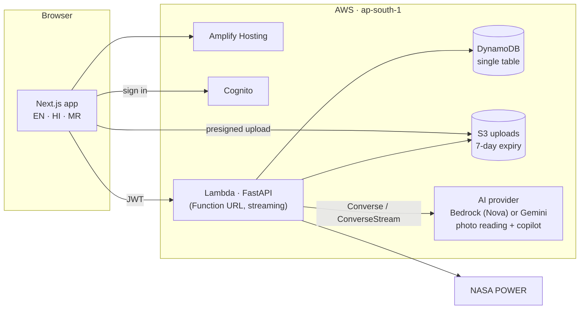

# Groundwork

**Know what your home runs on.**

**Live app:** https://main.dj7ciboa1zoj1.amplifyapp.com · click **Try the demo** to open a sample household, no sign-up.

Groundwork is a resource-savings app for Indian homes and housing societies. It starts from what a household already has, an electricity bill, a water meter and a pile of waste, and turns each into a concrete action with a rupee figure on it. Everything that actually changes is tracked in one ledger: **₹ saved · kWh · litres · kg kept out of landfill · CO₂ avoided**.

## What it does

- **Solar and your bill.** Photograph an electricity bill. Groundwork reads it, you confirm the numbers, and it recalculates the bill from your DISCOM's tariff. It then sizes a rooftop system to your use, roof and sanctioned load, applies the PM Surya Ghar subsidy, and works out payback month by month at your own slab rates. Sunlight comes from NASA POWER for your exact roof.
- **Water.** Take a meter or tank reading at night and again in the morning. If anything moved, something is leaking. Groundwork estimates the litres lost, walks you through finding the leak, and counts savings only once your readings show use has dropped. It also handles tank forecasts, tanker costs and a simulated smart-meter feed.
- **Waste.** Photograph a pile. Groundwork sorts it into the four streams of the Solid Waste Management Rules, 2026 (wet, dry, sanitary, special care) plus e-waste. It shows an indicative scrap value and lets you request a pickup from a recycler listed near you.
- **Copilot.** A chat that answers questions about your own electricity, water and waste in English, Hindi or Marathi. You can attach a photo, and answers come with cards (a solar summary, a leak alert, the items in a photo).
- **Societies.** A housing society can see its combined savings, participation and leaks found. Households are ranked against their own past use, never against each other, and appear on the leaderboard only if they opt in.
- **Reports.** A monthly report card, an impact report and a society report, all printable to PDF with every number's working and every source.

## How it's built

**AI reads, code calculates.** Models read photos and write words. Every number comes from a tested function in `services/api/app/calc/`, and every calculation returns its working. Each figure in the app has a "How we calculated this" drawer that shows the formula, the inputs and the source.



| Part | What's used |
|---|---|
| Web | Next.js 15 (App Router), TypeScript, Tailwind CSS 4, next-intl, Radix, TanStack Query, MapLibre with OpenFreeMap |
| API | Python 3.12, FastAPI on Lambda (arm64, Lambda Web Adapter), Pydantic, boto3 |
| AI | Photo reading uses forced tool-use JSON through one provider layer (`services/api/app/services/ai.py`): Amazon Bedrock (Nova Lite) by default, or Gemini with a quota-aware fallback across models and a cache for identical requests. The copilot is a Strands Agents orchestrator with solar, water and waste specialist agents, streamed over Server-Sent Events |
| Data | DynamoDB single-table design, S3 for short-lived uploads, Cognito for sign-in |
| Infra | AWS SAM (`infra/template.yaml`), Amplify Gen 2 (`amplify/`) |

The copilot can only read the signed-in user's data. Every tool it calls is bound to the user id from the verified sign-in token, never to anything the model says.

## Sources and accuracy

The Methodology page in the app lists every formula, constant and tariff with its source and date. It is generated from the same data files the calculations read. In short:

- **Tariffs:** residential tariffs for MSEDCL, Tata Power Mumbai, Adani Electricity Mumbai, BESCOM and BSES Rajdhani, each transcribed from the regulator's order.
- **Subsidy:** PM Surya Ghar rates from the government's own guidelines.
- **Grid emission factor:** from the CEA CO₂ baseline database.
- **Water benchmark:** from CPHEEO.
- **Waste:** CO₂ factors from US EPA WARM; scrap prices are indicative and are never counted as savings.

### Testing and validation

| Check | Result |
|---|---|
| Solar yield vs the European Commission's PVGIS (1 kW, flat panels) | Within 5.3% in Pune (+2.2%), Mumbai (+5.3%), Bengaluru (+4.6%), Delhi (−3.3%) and Chennai (+0.6%). Target ±12% |
| Overnight leak detector, synthetic meter data with 20 injected leaks per run | Precision 0.974 (worst run 0.947), recall 1.0. Real-world performance is measured in the pilot |
| Python and TypeScript calculations agree | Shared fixtures checked in both test suites |
| API | 257 pytest tests with mocked AWS, including a security sweep (every private route needs a token; no user ids in request bodies) |
| Web | 130 unit tests and 80+ Playwright browser tests on desktop and mobile, including an axe accessibility scan of every page in light and dark mode |

### Photo reading and the copilot

Measured with `scripts/eval_photos.py` against the live provider (sample sizes are small, and the numbers are re-run as the code changes):

| Photos | Sample | Result |
|---|---|---|
| Bills | 5 synthetic bills (rendered with known values, then rotated, blurred and shaded) | Units, billing period, amount, DISCOM and sanctioned load all read correctly in 5 of 5. Synthetic, so this tests reading and the code checks, not the range of real bill layouts |
| Waste | 15 TrashNet photos (cardboard, glass, metal, paper, plastic) | The first item falls in the right material family in 15 of 15 |
| Water meters | 10 photos from a public dataset, each read twice and reconciled in code | Exact to the litre: 5 of 10. Right to the nearest cubic metre: 7 of 10. Every doubtful reading is flagged for the user to check; none that was wrong by a whole cubic metre was marked high confidence |

Run `python scripts/fetch_eval_photos.py` to download the sample photos, then `python scripts/eval_photos.py`. Every photo reading goes through a confirm screen before anything is saved. Copilot routing is measured with `scripts/eval_copilot.py`.

## Development

Tooling: Node 20+, pnpm, Python 3.12, [uv](https://docs.astral.sh/uv/), AWS CLI v2, AWS SAM CLI.

```sh
# Web (Next.js)
pnpm install
pnpm dev:web                 # http://localhost:3000

# API (FastAPI)
cd services/api
uv venv --python 3.12 .venv
uv pip install --python .venv -r requirements-dev.txt
.venv/Scripts/python -m uvicorn app.main:app --reload --port 8080   # macOS/Linux: .venv/bin/python
.venv/Scripts/python -m pytest
```

Browser tests run against a production build with mock sign-in and a fake API:

```sh
cd apps/web
pnpm e2e:build
pnpm exec playwright test
```

The Python calculations are canonical. After changing anything in `services/api/app/calc` or its data files, run `python scripts/sync_calc.py` to update the TypeScript mirror; the tests fail if the two drift apart.

### Deploy

- **API:** `scripts/deploy_api.sh dev` (or `prod`). It builds a Linux arm64 package with uv (no Docker needed) and runs `sam deploy` to `ap-south-1`. The stack output `ApiUrl` is the Function URL. Check it with `curl <ApiUrl>health`.
- **Web:** Amplify Hosting, connected to this repository. `amplify.yml` sets `apps/web` as the app root. In the Amplify console, set `AMPLIFY_MONOREPO_APP_ROOT=apps/web`, then `NEXT_PUBLIC_API_URL` and the Cognito IDs from the auth stack.

### Layout

```
apps/web/            Next.js app: pages, components, messages (en, hi, mr), e2e tests
services/api/app/    FastAPI: routes, services, calc (pure, traced), agents (copilot), data (tariffs, constants)
infra/               SAM template for the API, DynamoDB, S3 and IAM
amplify/             Amplify Gen 2 auth
scripts/             Evals, data sync, local stack, simulators, build and deploy
```

## Privacy

Groundwork stores the numbers it needs, not documents. Uploaded photos are deleted within 7 days, and nobody sees another household's records. Users can download or delete everything from Settings. The full policy is on the Privacy page.

## License

MIT. See [LICENSE](LICENSE).
